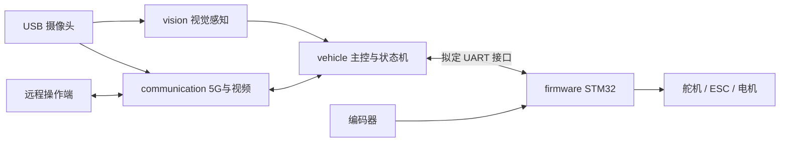

# 2026 室外 5G 远程驾驶无人车赛

本仓库用于队伍共同开发无人车的软件、固件、通信方案和硬件文档。**先按模块找目录，再在个人任务分支提交，通过 Pull Request 合并。**

目前处于项目初始化阶段：已建立目录和协作约定，尚未实现可运行的整车程序。目录存在不代表对应功能已经完成。

## 新队员从这里开始

1. 阅读本页，确定自己的代码应放在哪个目录。
2. 在 [团队分工表](docs/team.md) 中补充姓名、GitHub 用户名和负责模块。
3. 按 [贡献指南](CONTRIBUTING.md) 完成 clone → 建分支 → commit → push → Pull Request。
4. 涉及其他模块的数据格式时，先查 [接口约定](interfaces/README.md)，再与相关队员一起修改。
5. 每次提交同步更新模块 README，写清运行方法和验证结果。

## 我的东西放在哪里？

| 分区 | 放什么 | 常见负责人 |
|---|---|---|
| [vision/](vision/README.md) | 摄像头输入、循迹、挡板、斑马线、红绿灯、锥桶、停车视觉 | 视觉同学 |
| [vehicle/](vehicle/README.md) | 树莓派主程序、模式切换、任务状态机、高层路径与运动指令 | 主控/控制同学 |
| [firmware/](firmware/README.md) | STM32 工程、PWM、编码器、速度/转向闭环 | 下位机同学 |
| [communication/](communication/README.md) | 5G 联网、视频回传、远程操作端、连接状态 | 通信同学 |
| [hardware/](hardware/README.md) | 型号清单、接线、供电、安装尺寸、标定记录 | 硬件同学 |
| [interfaces/](interfaces/README.md) | 视觉结果、运动命令、UART 协议等跨模块约定 | 相关模块共同维护 |
| [configs/](configs/README.md) | 整车共享配置示例；个人参数使用本地文件 | 各模块同学 |
| [data/](data/README.md) | 少量可公开测试样例、标注说明、外部数据索引 | 视觉/测试同学 |
| [models/](models/README.md) | 模型来源、版本、训练与部署说明 | 视觉同学 |
| [tools/](tools/README.md) | 环境检查、录制、标定、日志分析等辅助工具 | 各模块同学 |
| [tests/](tests/README.md) | 跨模块集成与回归验证 | 联调负责人 |
| [experiments/](experiments/README.md) | 尚未合入正式模块的独立实验 | 所有队员 |
| [docs/](docs/README.md) | 架构、规则核对、技术报告、测试记录和资料索引 | 所有队员 |

**提交源码和复现说明；大录像、系统镜像、模型权重和运行日志使用数据索引管理。** 模块自己的配置、依赖、测试可放在模块目录；只有跨模块共享的内容放根目录公共分区。

## 当前硬件基线与模块关系

- 上位计算平台：计划 Raspberry Pi 4B 8GB，承担图像处理、任务状态机和高层控制。
- 视觉：WXSJ-H65HD USB 广角摄像头，尚未完成出图及采集参数测试。
- 姿态：WIT-Motion IMU，UART 通信，具体型号、电平与协议待确认。
- 通信：现有蜂窝/5G 模块，具体型号、接口和联网方式待确认。
- 动力与供电：已有电机、ESC、约 12 V 锂电池和 DC-DC；实际电压、电流能力与接法以实测记录为准。
- 下位机：计划增加 STM32，负责舵机/ESC、PWM、编码器和闭环，具体芯片与串口协议待确定。

项目不默认使用 ROS。首先支持电脑上的离线开发，再到树莓派和实车验证。



这是职责示意，并非已完成接线；摄像头应由统一采集服务分发，避免两个程序竞争设备。详细边界见 [系统架构](docs/architecture.md)。

## 比赛任务与当前注意事项

依据队伍提供的 **2026 年 8 月规则初稿**，目标流程为：

**5G 远程驾驶 → 切换区停稳 → 蓝挡板移开发车 → 自主循迹 → 斑马线停车与播报 → 红绿灯 → 红/蓝锥桶避障 → 未遮挡车位停车 → 队员远程扫码。**

初稿有停车 3 秒/10 秒、指定/推荐设备等不一致表述；现有硬件能否参赛需要核实。摄像头位置也受规则限制。请以 [规则版本与待确认清单](docs/rules/README.md) 为依据，不把前辈方案或硬件示例参数直接当作本车要求。

## 开发状态

| 模块 | 当前状态 | 下一项可交付成果 |
|---|---|---|
| 视觉 | 规划中 | 图片/录像回放、基础循迹和调试结果 |
| 主控与状态机 | 待开发 | 模拟输入驱动的任务流程 |
| STM32 | 硬件及工程待确认 | 工程可构建、接口与台架记录 |
| 5G 通信 | 型号及环境待确认 | 联网和视频传输验证 |
| 硬件 | 清单待补全 | 型号照片、供电与接线记录 |

本仓库暂无统一安装或启动命令。各模块提供真实可用的命令后，再补充整车启动入口；不要把未验证的命令标成“已可运行”。

## 提交示例

以下示例假设已经 clone 仓库，并且工作区没有未提交修改：

```bash
git switch main
git pull --ff-only origin main
git switch -c feat/vision-video-reader
# 在 vision/ 内完成修改
git add vision/
git diff --cached
git commit -m "feat(vision): 增加录像输入"
git push -u origin feat/vision-video-reader
```

随后在 GitHub 新建 Pull Request，目标分支选 `main`。首次使用 Git、无写入权限、冲突处理及后续同步详见 [CONTRIBUTING.md](CONTRIBUTING.md)。

本仓库公开可见。提交前检查暂存内容，确保没有密码、令牌、个人连接配置、无授权资料或大文件。参考材料应记录来源；自己的实现与实验结论应可复现。团队尚未选择开源许可证。
