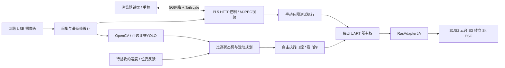

# 2026 室外 5G 远程驾驶无人车赛

**当前基线（2026-10-08）：Raspberry Pi 5 + RasAdapter5A 串口扩展板，纯树莓派应用控制，不使用独立 STM32。**

当前源码已经包含双摄感知、网页遥控、UART 执行、比赛状态机和自主运行框架。有限低速/5G 测试有历史记录；**完整自主赛道尚未实车验收，真实自主输出仍被未完成标定项阻止。**

- [当前进度与待办](docs/current-status.md)：唯一当前状态入口。
- [源码审查与改进建议](docs/reviews/2026-10-08-source-review.md)：功能、技术栈、复现的问题、改进优先级。
- [系统架构](docs/architecture.md)、[硬件基线](hardware/README.md)、[接口](interfaces/README.md)。
- [团队分工](docs/team.md)和[贡献流程](CONTRIBUTING.md)：保持独立分支 → PR → 合并。

## 实际架构


```mermaid
flowchart LR
    Remote[浏览器键盘 / 手柄] <-->|5G网络 + Tailscale| Web[Pi 5 HTTP控制 / MJPEG视频]
    Cam[两路 USB 摄像头] --> Capture[采集与最新帧缓存]
    Capture --> Web
    Capture --> Perception[OpenCV / 可选比赛YOLO]
    Perception --> Decision[比赛状态机与运动规划]
    Feedback[待验收的速度 / 位姿反馈] --> Decision
    Web --> Manual[手动有限测试执行]
    Manual --> UART[独占 UART 所有权]
    Decision --> Auto[自主执行门控 / 看门狗]
    Auto --> UART
    UART --> Board[RasAdapter5A]
    Board --> Output[S1/S2 云台 S3 转向 S4 ESC]
```

手动与自主不允许同时占有串口，实际交接仍需整车验收。上图的反馈输入不表示编码器已接通；板内 PWM 回读不等于轮速或实际舵角。

## 技术栈

Python ≥3.10；OpenCV 4.11.0.86；NumPy 2.2.6；PyYAML 6.0.2；原生 HTML/CSS/JavaScript；Python HTTP/1.1 + MJPEG；Linux UART/V4L2/I2C/systemd；pytest 与 Node.js 浏览器逻辑检查。Ultralytics、ONNX/ONNX Runtime 是可选训练/推理依赖，比赛权重仍待验收。项目不依赖 ROS。

## 代码放在哪里

| 目录 | 当前用途 |
|---|---|
| `vision/src/carvision/` | 现阶段实际运行包；同时含视觉、遥控、状态机和树莓派驱动，尚未按顶层规划拆包 |
| `vision/configs/` | 感知、比赛、Pi5 标定配置；实测值保留，未完成项仍为 false/null |
| `vision/tests/` | 离线、模拟驱动和小图片夹具测试 |
| `vision/tools/` | 预览、台架、检查、打包和显式部署工具 |
| `drivers/pigpio/` | 早期 Pi4 路径所需第三方 C 源码、来源和许可证；不是当前 UART 后端 |
| `vehicle/`、`communication/`、`hardware/` | 职责索引和当前接入说明，避免误以为另有一套可运行主程序 |
| `firmware/stm32/` | 不采用的早期规划记录，不是当前待开发任务 |
| `interfaces/` | 感知、比赛观测及当前 UART 说明 |
| `run/` | 原包自带少量核验/标定 JSON；不提供当前开机授权；其他新运行日志默认忽略 |
| `docs/` | 当前进度、审查、规则及团队文档 |

## 电脑离线检查

建议独立 Python 3.12 环境，浏览器模拟测试另需 Node.js。以下命令不启动实车：

```sh
python -m venv .venv
# Windows 激活：.venv/Scripts/Activate.ps1
# Linux 激活：source .venv/bin/activate
python -m pip install -e "vision[test]"
python -m pytest vision/tests -q -ra
python -m carvision autonomy-check --profile vision/configs/autonomy-pi5.json
python -m carvision autonomy-demo --profile vision/configs/autonomy-pi5.json --race-config vision/configs/race-2026.json --output run/new-demo
python tools/audit_snapshot_20261008.py
```

输出目录必须是新目录。原配置的正常检查结果是 **18 个准备缺项**；demo 的 complete 只代表决策回放完成，不能当作车已经跑完。最近本地 Windows 原测试集 692 通过 / 3 跳过（Linux 专用项）。CI 在 Linux/Windows 上运行软件检查，不操作硬件。

实车相关入口见 [MANUAL_BENCH](vision/MANUAL_BENCH.md) 与 [AUTONOMY_PI5](vision/AUTONOMY_PI5.md)，先阅读当前状态；两份文档保留历史段落。不要沿用旧 GPIO 接线或旧开机记录。当前同步未部署到车、未改变运动保护或标定数据。

## 比赛目标

5G 远程驾驶 → 换区停稳 → 蓝挡板移开 → 自主循迹 → 斑马线停车播报 → 红绿灯 → 红/蓝锥桶 → 未遮挡车位 → 队员扫码。

依据队伍提供的 2026 年 8 月规则初稿；3/10 秒、设备资格等疑点见 [规则记录](docs/rules/README.md)。当前硬件方案与参赛资格是两回事，仍需队伍确认。

## 源码来源与历史

本次来源为 2026-10-08 源码包；原包 [SOURCE-MANIFEST](SOURCE-MANIFEST.json) 已核验。原 README 保留为 [SOURCE_HISTORY](SOURCE_HISTORY_20261008.md)，其他较早报告只作为历史。原始 manifest 针对原包，README 改名、文档脱敏及部署主机参数化差异由 [发布映射](docs/reviews/publication-manifest-20261008.json) 记录。

仓库公开可见，不包含密码、令牌、SSH 私钥、Python 环境、大录像或模型权重；历史连接地址已经替换为占位符，不能直接用于联网。个人部署地址需自行显式填写，主机密钥仍须已可信。团队尚未选择整体开源许可证，第三方代码保留各自许可证。
